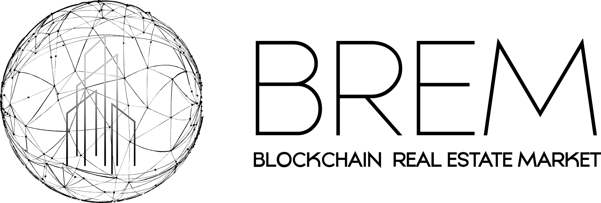

  

# Brem

# Project descruption 
BREM platform is a perspective investment project of the world's
first online portal for real estate transactions (from now on referred
to as the"Portal" or "Platform"), created with the blockchain technology. This portal aims to unite the Developers with a full, world-scale base
of real estate objects (placing objects on the platform), and the real estate agencies and investors (the buyers).

# Dependencies 

# Smart contracts

# Token issuance process walkthrough

# Created by 

  

