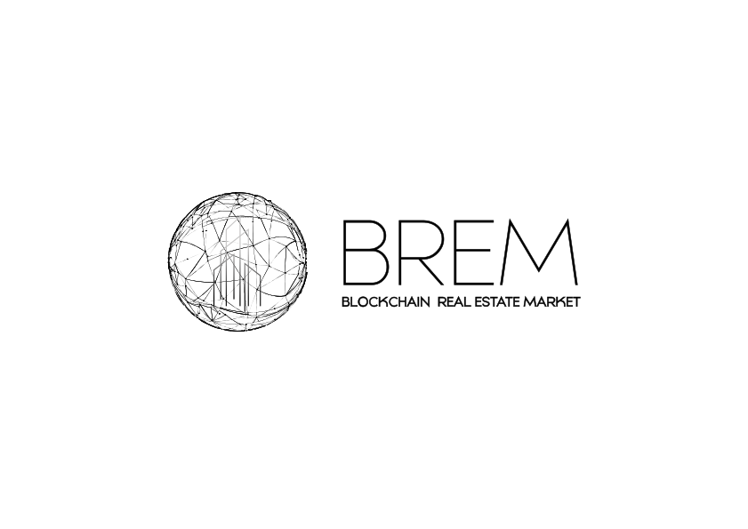

  

# Brem

# Project descruption 
Hyperion Token - Сonstruction of solar power stations.

Hyperion Token  is 1 Watt distributed among grid

# Dependencies 

# Smart contracts

# Token issuance process walkthrough

# Created by 

  

